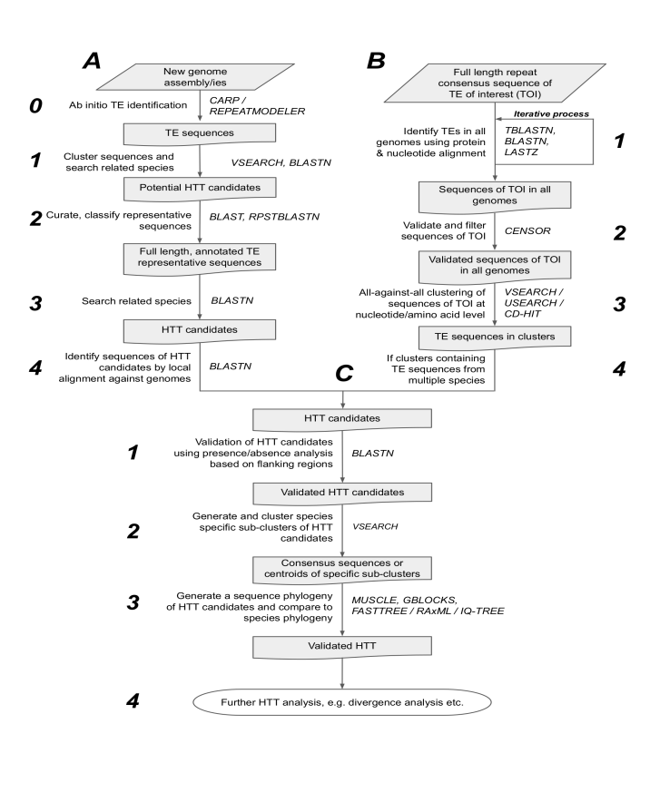

# Detecting Horizontal Transfer of Transposons (HTT)

By James D. Galbraith, Atma M. Ivancevic, Zhipeng Qu and David L. Adelson

## Table of Contents

- [Introduction](#introduction)
- [Prerequisites](#prerequisites)
  - [Recommended programs/tools](#recommended-programs)
  - [Optional programs/tools](#optional-programs)
  - [For users](#for-users)
- [Workflows](#workflows)
  - [A: Ab initio workflow](#workflowA)
  - [B: Workflow for global HTT screening of specific
        TEs](#workflowB)
  - [C: HTT candidates validation](#workflowC)
- [Additional notes](#notes)
- [References](#references)
- [The end](#the-end)

## Introduction

The specific steps for the identification of HTT events are typically applied to two scenarios with distinct workflows (A and B in Figure 1) that converge at the stage where HTT candidates are validated (C in Figure 1). Workflows A, B and C are described below, with numbered steps in each section that link back to Figure 1.



## Prerequisites

### Recommended programs/tools <a name="recommended-programs" />

- BLAST (<https://blast.ncbi.nlm.nih.gov/Blast.cgi>)
- SAMtools (<http://www.htslib.org/>)
- BEDtools (<http://bedtools.readthedocs.io/en/latest/>)
- CENSOR, which requires wu-blast and bioperl (<https://girinst.org/downloads/software/censor/>)
- USEARCH (<https://www.drive5.com/usearch/>)
- VSEARCH (<https://github.com/torognes/vsearch>)
- MUSCLE (<https://www.drive5.com/muscle/>)
- MAFFT (<https://mafft.cbrc.jp/alignment/software/>)
- RepeatMasker (<http://www.repeatmasker.org/>)
- Repeatmodeler (<https://www.repeatmasker.org/RepeatModeler/>)
- Alignment viewer (e.g. JalView, <https://www.jalview.org/>)
- R (<https://www.r-project.org/>)
- Required packages: tidyverse, plyranges, BSgenome, optranges

### Optional programs/tools <a name="optional-programs" />

- CARP (<https://journals.plos.org/plosone/article?id=10.1371/journal.pone.0193588>)
- LASTZ (https://www.bx.psu.edu/\~rsharris/lastz/)
- SiLiX (<http://lbbe.univ-lyon1.fr/-SiLiX-?lang=en>)
- Gblocks (<https://ls23l.lscore.ucla.edu/MakeTree/documentation/gblocks.html>)
- HMMer (<http://hmmer.org/>)
- FastTree (<http://www.microbesonline.org/fasttree/>)
- IQ-TREE (<http://www.iqtree.org/>)
- CD-HIT (<http://weizhong-lab.ucsd.edu/cd-hit/>)

### For users <a name="for-users" />

Our methods are implemented in Linux/R and we assume that users will be familiar with the bash shell and R. Some level of familiarity with queuing systems in HPC is also recommended.

## Workflows

### A: *Ab initio* workflow <a name="workflowA" />

Pipeline A is designed to identify potential horizontally transferred sequences in newly sequenced genomes based on their absence from the genome of a closely related species.

All input files should be FASTA files. Raw repeats can be from any *ab initio* software package. Input genomes should be in `Pipeline_A/genomes/` folder.

***Usage***

NOTE: Assume you are in `Pipeline_A` folder to run the following scripts.

**0) Ab initio TE annotation using RepeatModeler.**

Run [HT\_stage\_0.sh](./Pipeline_A/HT_stage_0.sh)

```bash
GENOME=<source_genome> THREADS=<number of threads to use> bash HT_stage_0.sh 
```

**1) Cluster and perform initial sweep and generate multiple alignments for manual curation of repeats.**

Run [HT\_stage\_1.sh](./Pipeline_A/HT_stage_1.sh)

```bash
GENOME=<source_genome> OUTGROUP=<outgroup_genome> QUERY=<file_containing_raw_repeats> THREADS=<number of threads to use> bash HT_stage_1.sh
```

This script performs an initial search for sequences which have 2 or more copies in the query genome and are absent from the outgroup genome. If any sequences are absent from the outgroup a multiple sequence alignment will be created for curation.

**2) Manually curate the alignments in Geneious, JalView or the like.**

This is necessary as most *ab initio* aligners do not capture full
repeats, and some families may be classified incorrectly. Additionally,
this step can reveal redundant sequences not removed from clustering,
e.g. non-autonomous DNA transposons derived from autonomous DNA
transposons.

**3) Confirm HTT condidates based on either repeating local alignment finding absence or higher-than-expected-divergence from the genomes of the most closely related species.**

Run [HT\_stage\_2.sh](./Pipeline_A/HT_stage_2.sh) using curated repeats as input.

```bash
GENOME=<source_genome> SPECIES=<name_of_source_species> OUTGROUP=<outgroup_genome> QUERY=<file_containing_curated_repeats> THREADS=<number of threads to use> bash HT_stage_2.sh
```

This script carries out a validation of the initial search using consensus sequences generated from the curation step. This is necessary as fragmented repeats which appeared to be mssing from an outgroup species may in fact be present. For example, when searching with TEs from a seal genome using a mustelid as the outgroup, stage 1 identified 4 L1 fragments which appeared to be absent from the mink. After curation it became clear those L1s were in fact present in the mustelid, just not identifed in the initial sweep, likely due to their truncation/fragmentation. The initial curation step fixes this problem by ensuring that searches of the outgroup genome are done with queries that contain the complete TE of interest.

**4) Local alignment of HTT condidates against all available genomes to identify most closely related sequences and species with no hits.**

Run [HT\_stage\_3.sh](./Pipeline_A/HT_stage_3.sh)

```bash
GENOME=<name_of_source_species> OUTGROUPS=<file_containing_list_of_genomes> QUERY=<file_containing_curated_repeats> THREADS=<number of threads to use> bash HT_stage_2.sh
```

This script searches for repeats verified as HTT candidates, searches for them in other species (from a list provided) and creates a MSA of each repeats if identified in a species ready for curation. This script is written to utilise genomes downloaded from Genbank and present in the `Pipeline_A/genomes/` folder and gzipped. If necessary modify this script for your particular situation.

***Example usage for Pipeline A***

- run genome\_downloader.sh to download all high quality snake and echinoderm genomes from GenBank (requires Entrez Direct)

- unzip *Laticauda* colubrina genome to use as source genome and *Naja naja* genome to use as outgroup

- run HT\_stage\_1.sh (example RepeatModeler output of *Laticauda colubrina* is in the data folder)

- manually curate potential HTT candidates

- run HT\_stage\_2.sh using curated HTT candidates

- run HT\_stage\_3.sh to examine other species in which HTT candidates are present in. With the example dataset several *Harbingers* identified in *Laticauda colubrina* will also be present in *Laticauda laticaudata* and various echinoderms

### B: Workflow for global HTT screening of specific TEs <a name="workflowB" />

Pipeline B is used for detecting potential horizontal transfer events, starting from a set of curated repeat consensus sequences from available sources (e.g. RepBase or Dfam) for the TE of interest.

It is a simplified version of the code used to infer horizontal transfer events involving L1 and BovB retrotransposons in eukaryotes ([Ivancevic et al., *Genome Biology*, 2018](https://genomebiology.biomedcentral.com/articles/10.1186/s13059-018-1456-7)).

***Usage***

NOTE: Assume you are in `Pipeline_B` to run following scripts.

**0) Download and prepare the genomes you want to screen.**

*0a) Append species names to the genome name.*

As the names given to genome assemblies are not usually informative, you will want to append species names to the genome names.

Run [0a\_rename\_genome.sh](./Pipeline_B/0a_rename_genome.sh).

Example usage:

```bash
GENOME=<source_genome> SPECIES=<species_name> bash 0a_rename_genome.sh
```

*0b) Make each genome a BLAST database and create indexes.*

Run
[0b\_make\_database\_and\_index.sh](./Pipeline_B/0b_make_database_and_index.sh).

Example usage:

```bash
bash 0b_make_database_and_index.sh
```

**1) BLAST TE of interest against all available genomes.**

*1a) Use TBLASTN with protein sequence queries.*

This will identify similar TEs in distantly related species. Output will be nucleotide sequences.

Run
[1a\_tblastn\_and\_extract.sbatch](./Pipeline_B/1a_tblastn_and_extract.sbatch).

Example usage:

```bash
DIR=test_genome DATABASE=YarrowiaLipolytica_ASM252v1.fa QUERY=L1_ORFp.fasta RESULTSDIR=results sbatch 1a_tblastn_and_extract.sbatch
```

*1b) (Optional) Use BLASTN or LASTZ with nucleotide sequence queries.*

Run
[1b\_lastz\_and\_extract.sbatch](./Pipeline_B/1b_lastz_and_extract.sbatch).

Example usage:

```bash
GENOMEDIR=test_genome GENOME=YarrowiaLipolytica_ASM252v1.fa QUERYDIR=test_query QUERY=L1_nucl_seqs.fasta RESULTSDIR=results sbatch 1b_lastz_and_extract.sbatch
```

*1c) For each genome, combine all identified nucleotide sequences from the previous steps.*

Run [1c\_combine\_hits.sbatch](./Pipeline_B/1c_combine_hits.sbatch).

Example usage:

```bash
SPECIES=YarrowiaLipolytica ELEMENT=L1 LASTZFILE=YarrowiaLipolytica_ASM252v1.fa_L1_nucl_seqs.fasta_lastz.bed TBLASTNFILE=YarrowiaLipolytica_ASM252v1.fa_L1_ORFp.fasta_merged.bed GENOME=YarrowiaLipolytica_ASM252v1.fa RESULTSDIR=results sbatch 1c_combine_hits.sbatch
```

*1d) Add header annotations to indicate the genome that each sequence was derived from.*

Run
[1d\_append\_name\_to\_headers.sh](./Pipeline_B/1d_append_name_to_headers.sh).

Example usage:

```bash
SPECIES=YarrowiaLipolytica ELEMENT=L1 RESULTSDIR=results bash 1d_append_name_to_headers.sh
```

Repeat screening in an iterative process (e.g. BLAST-ing the new, larger, query dataset against each genome and then combining the output) until no new hits are found.

**2) Perform a reciprocal best hit check.**

*2a) Use CENSOR to compare hits against known repeat databases (e.g. RepBase or Dfam).*

Run
[2a\_censor\_sequences.sbatch](./Pipeline_B/2a_censor_sequences.sbatch).

Example usage:

```bash
INDIR=results FILE=YarrowiaLipolytica_L1_combined.fasta OUTDIR=results/censored sbatch 2a_censor_sequences.sbatch
```

*2b) Confirm and extract hits that match the correct TE family.*

Run
[2b\_check\_censor\_output.sbatch](./Pipeline_B/2b_check_censor_output.sbatch).

Example usage:

```bash
SPECIES=Yarrowia.lipolytica FILE=Yarrowia.lipolytica_L1_combined.fasta GENOME=test_genome/YarrowiaLipolytica_ASM252v1.fa ELEMENT=L1 QUERY=test_query/known_L1_elements_from_repbase.txt CENSORDIR=results/censored sbatch 2b_check_censor_output.sbatch
```

**3) Cluster all sequences obtained from the iterative alignment screening.**

Prior to this step, you will need to combine hits from all genomes into one file. Make sure that sequence headers indicate the species that each TE sequence was derived from.

This clustering step is important as it will reveal likely HTT events which are manifested as clusters of highly similar elements that include elements from multiple species. We have found it best to use sequence divergence cut offs that cluster most closely related sequences (e.g. \<20% divergent).

*3a) All-against-all clustering of nucleotide sequences using VSEARCH.*

You can use full-length nucleotide sequences, or nucleotide sequences of the open reading frames only.

Run
[3a\_vsearch\_cluster\_for\_nucleotide\_seqs.sbatch](./Pipeline_B/3a_vsearch_cluster_for_nucleotide_seqs.sbatch), changing the clustering identity threshold (ID) as required.

Example usage:

```bash
INDIR=results/allSpeciesCombined FILE=allSpecies_L1.fasta ID=80 PREFIX=c sbatch 3a_vsearch_cluster_for_nucleotide_seqs.sbatch
```

*3b) All-against-all clustering of amino acid sequences using USEARCH.*

VSEARCH (the open source alternative to USEARCH) does not support protein sequences, but will not fail if given protein sequence input. Make sure you use another program (e.g. Cd-hit or USEARCH) to clustering amino acid sequences. The 32-bit version of USEARCH is open source.

The following script can be used to perform all-against-all cluserting of amino acid sequences from ORFs, or reverse transcriptase domains from retrotransposons/transposase domains from DNA transposons.

Run
[3b\_usearch\_cluster\_for\_aa\_seqs.sbatch](./Pipeline_B/3b_usearch_cluster_for_aa_seqs.sbatch).

Example usage:

```bash
INDIR=results/allSpeciesCombined FILE=allSpecies_L1_ORFp.fasta ID=90 PREFIX=r sbatch 3b_usearch_cluster_for_aa_seqs.sbatch
```

**4) Identify clusters containing TE sequences from multiple species (e.g. based on the sequence header names).**

These clusters are the HTT candidates.

***Test dataset for Pipeline B***

A test genome (fungus *Yarrowia lipolytica*) has been placed in [test\_genome](./Pipeline_B/test_genome), along with a set of L1 repeats as a [test\_query](./Pipeline_B/test_query). We recommend trying out the workflow using these files first.

### C: HTT candidates validation <a name="workflowC" />

Pipeline C includes several additional steps to validate detected HTT candidates from Pipeline A or Pipeline B. Manually checking will be required in this section.

***Usage***

NOTE: Assume you are in `Pipeline_C` folder to run these following scripts.

**1) Presence/absence analysis based on flanking regions.**

Extend individual TE insertions with 1-2kb of flanking sequence and align those sequences to the genomes of related/target species. Use the coordinates from these alignments to find the ends of the target sequences and extract those sequences from the target genomes. The query and target sequences are then globally aligned (MAFFT/MUSCLE) to determine presence/absence compared to ancestral insertions in related taxa (Manually checking in aligment viewer will be required).


**2) Generate and cluster species-specific sub-clusters using VSEARCH or USEARCH, and align all sub-clusters to create consensus sequences, or identify centroids.**

Run [2\_usearchConsensus.sbatch](./Pipeline_C/2_usearchConsensus.sbatch)

Example usage (please modify job settings according to your HPC environment):

```bash
INDIR=results FILE=HTT_condidates.fasta ID=80 sbatch 2_usearchConsensus.sbatch
```

**3) Align all consensus sequences/centroids to generate a sequence phylogeny.**

Global multisequence alignment of representative sequences to generate a phylogenetic tree of HTT candidate sequences. This phylogenetic distribution of representative sequences can be compared to the species phylogeny to see if it is discordant.

Run
[3\_alignRefineAndTree.sbatch](./Pipeline_C/3_alignRefineAndTree.sbatch)

Example usage (please modify job settings according to your HPC
environment):

```bash
INDIR=results FILE=HTT_condidates_centroids.fasta MINBLOCKSIZE=5 ALLOWEDGAPS=a sbatch 3_alignRefineAndTree.sbatch
```

**4) Further analysis**

Divergence analysis of HTT candidate clusters to determine activity profile and ensure that this profile is consistent with transfer from the most closely related TE from another species. Additional/alternative methods might include:

- using a k-mer based method (e.g Jellyfish) to compare k-mers within TE sequences. Jellyfish provides an alignment-free alternative for detecting similarities in TEs across species.

- using intact ORFs to determine how recently TEs in different species were likely active, to estimate the timing of potential HTT events.

- BLAST-ing sequences from HTT candidate clusters against all eukaryotes on NCBI (not just your database of genomes) to identify potential vector/source species.

## Additional notes <a name="notes" />

1. Software based TE annotation must be manually curated prior to
        analysis, as no software tool is guaranteed to find full length
        TEs, or find all full length TEs.

2. For TEs with two open reading frames, concatenating ORF1 and
        ORF2 sequences before running TBLASTN may give the best results.

3. We recommend using a combination of TBLASTN (protein sequence
        input, e.g. TE ORFs) and BLASTN (nucleotide sequence input,
        e.g. full-length TE) for identifying horizontally transferred
        TEs in a wide range of genomes. If only using one method,
        TBLASTN should be prioritised, especially when looking for TEs
        of the same family in distantly related species. Nucleotide
        queries (e.g. with BLASTN) may fail to identify TEs that have
        had longer to mutate/diverge.

4. VSEARCH (the open source alternative to USEARCH) does not
        support protein sequences, but will not fail if given protein
        sequence input. Make sure to use another program (e.g. Cd-hit or
        USEARCH) for clustering of amino acid sequences. The 32-bit
        version of USEARCH is open source.

5. Confirmation of presence/absence is only practical for small
        numbers of HTT events that can be evaluated by eye.

6. Alignment viewers such as JalView can also perform principal
        component analysis (PCA) of all sequences in a multiple sequence
        alignment, where each dot represents an individual TE sequence,
        and dots can be coloured by species. This allows easy
        visualisation of HTT clusters containing highly similar
        sequences from different species.

## References

- Galbraith JD, Ludington AJ, Suh A, Sanders KL, Adelson DL. New Environment, New Invaders-Repeated Horizontal Transfer of LINEs to Sea Snakes. *Genome Biol Evol.* 2020;12:2370--83.
- Galbraith JD, Ludington AJ, Sanders KL, Suh A, Adelson DL. Horizontal transfer and subsequent explosive expansion of a DNA transposon in sea kraits (Laticauda). *Biol Lett.* 2021;17:20210342.
- Ivancevic AM, Kortschak RD, Bertozzi T, Adelson DL. Horizontal transfer of BovB and L1 retrotransposons in eukaryotes. *Genome Biol.* 2018;19:85.
- Ivancevic, Atma M, Kortschak, R Daniel, Bertozzi, Terry, & Adelson, David L. (2018). Dataset from: Horizontal transfer of BovB and L1 retrotransposons in eukaryotes \[Data set\]. *Zenodo.* <http://doi.org/10.5281/zenodo.1246946>
- Ivancevic Atma M. (2018, May 15). AdelaideBioinfo/horizontalTransfer: First release of horizontal transfer code (Version v1.0.0). *Zenodo.* <http://doi.org/10.5281/zenodo.1246999>

## The end <a name="the-end" />

> *Remember that all models are wrong; the practical question is how wrong do they have to be to not be useful.*

George Box in; Box, G.E.P. and Draper, N.R. Empirical Model Building and Response Surfaces. John Wiley & Sons, New York. (1987).
